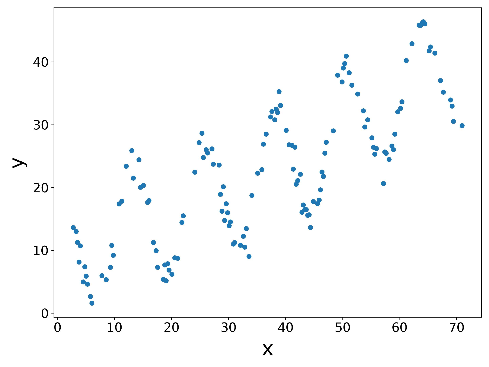

# 과제#1 회귀 함수 챌린지

- 주어진 데이터를 잘 나타내는 한 편, 예측력도 높은 함수 $f(x)$를 설계하는 과제입니다.

- 모든 코드는 `regression.py` 파일에 작성하며, 파일명을 변경하면 안 됩니다. 파일명을 변경하는 경우 평가 시스템에서 오류가 발생하게 됩니다.

- [BDC 클라이언트](https://github.com/bluedragonclub/bdc-client)를 이용하여 BDC 서버에 `regression.py`를 제출하면 채점이 진행됩니다.

- BDC 클라이언트를 사용하는 방법은, 수업 Discord 서버의 `announcement` 채널에서 제공하는 튜토리얼 슬라이드를 참고하시기 바랍니다.

- 과제의 최종 점수는 제출 기한 이후 최종 순위에 따라 차등 결정됩니다.

- 제출 기한은 **2024년 10월 29일 화요일 오후 11시 59분** 입니다.


## 문제 정의

- `regression.py`에 `func` 함수를 작성합니다.

    ```
    # regression.py

    import numpy as np

    
    def func(x):
        y = x   # Replace this line with your code.
        return y
    ```
    
- `regression.py`에서 패키지는 `numpy`만 사용할 수 있습니다. 

- `train_data.csv`는 본 과제에서 제공하는 데이터(훈련 데이터)이며, 아래와 같이 $x$와 $y$에 대한 값을 포함합니다.

    ```CSV
    x,y
    2.756892230576441,13.61979101816075
    3.258145363408521,13.012824847538296
    3.508771929824561,11.277701838446498
    3.7593984962406015,8.13990032421272
    4.010025062656641,10.701662329793086
    4.511278195488721,4.9620508512333075
    4.761904761904762,7.364048319101164
    5.012531328320802,5.8877021094206645
    5.263157894736842,4.610493618120029
    5.764411027568922,2.6402806168163298
    ⋮    
    ```

- `plot_data.py`는 데이터 시각화를 위한 예시 코드를 제공합니다.


- 본 과제에서 함수 $f(x)$가 종속 변수 $y$를 잘 설명하고 예측하는지 살펴보기 위하여 성능 측정 지표(metric)로서 [MSE(mean squared error)](https://en.wikipedia.org/wiki/Mean_squared_error)를 사용합니다.

$$
MSE := \frac{1}{n}\sum_{i=1}^{n}{\Big(y - f(x)\Big)^2}
$$

- 다음은 MSE를 계산하는 Python 코드 예시입니다.

    ```
    import numpy as np
    from regression import func

    ...

    # Predict the y-values with my function.
    y_hat = func(x)

    # Calculate the mean squared error (MSE).
    mse = np.mean((y - y_hat)**2)
    ```

- 본 과제의 최종 평가 척도는 문제(1)의 MSE와 문제(2)의 MSE를 합한 값입니다.

- 다음은 본 과제에서 제공하는 데이터(훈련 데이터)를 시각화한 것입니다.
    <p align="center">
        
    </p>


### 문제(1)

- 본 문제에서는 제공된 데이터(훈련 데이터)를 `func` 함수가 잘 **적합(fitting)**할 수 있는지 테스트합니다.
- 본 문제의 평가 데이터는 훈련 데이터를 포함하며, 훈련 데이터에는 없지만 훈련 데이터의 $x$ 및 $y$의 범위에 존재하는 **별도의 데이터**도 포함합니다.
- 평가 데이터의 범위는 아래와 같습니다.

$$
\begin{align*}
  1 < x < 71 \\
  1 < y < 50
\end{align*}
$$

### 문제(2)

- 본 문제에서는 `func` 함수가 훈련 데이터의 범위를 벗어나는 데이터를 잘 **예측**할 수 있는지 테스트합니다.
- 본 문제의 평가 데이터는 훈련 데이터에는 **없는** 데이터로서, $x$와 $y$의 범위는 다음과 같습니다.

$$
\begin{align*}
 71 \rg x < 101 \\
 30 < y < 80
\end{align*}
$$
